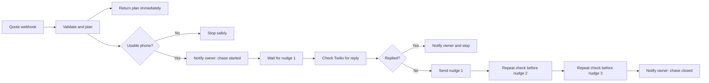

# Workflow diagram

```mermaid
flowchart LR
    A[Quote webhook] --> B[Validate and plan]
    B --> C[Return plan immediately]
    B --> D{Usable phone?}
    D -- No --> E[Stop safely]
    D -- Yes --> F[Notify owner: chase started]
    F --> G[Wait for nudge 1]
    G --> H[Check Twilio for reply]
    H --> I{Replied?}
    I -- Yes --> J[Notify owner and stop]
    I -- No --> K[Send nudge 1]
    K --> L[Repeat check before nudge 2]
    L --> M[Repeat check before nudge 3]
    M --> N[Notify owner: chase closed]
```

Every send is preceded by a fresh inbound-message lookup. A reply after `started_at` diverts the execution to the owner notification and ends that cadence.
